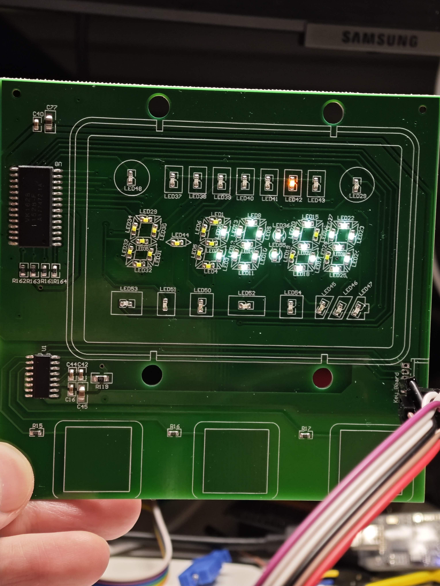

A project for a clock board with touch button based on ESP32

This is a board bought from Xianyu(Secondhand online platform in China), and it contains a LED clock display and 3 touch buttons, the LED clcok display is based on VK1628, and touch buttons are based on FTC334C

